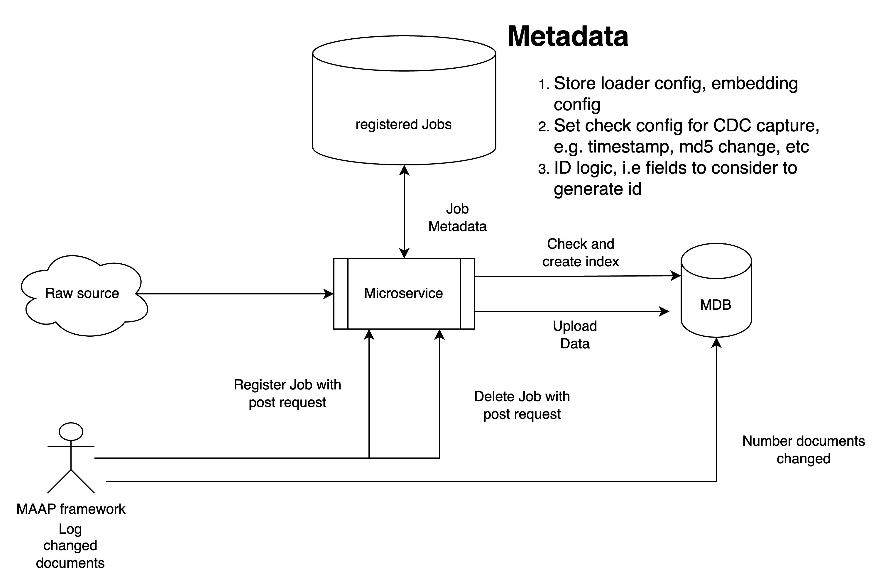

# Enterprise Data Loader (Using unstructured)

## Table of Contents

1. [Overview](#overview)
2. [System Architecture](#system-architecture)
3. [Installation & Deployment](#installation--deployment)
4. [Usage](#usage)
5. [API Reference](#api-reference)

### Overview

The MAAP Data Loader application is designed to synchronize data from various sources (local filesystems, S3 buckets, Google Drive) to a MongoDB database using [unstructured.io](https://unstructured.io) (MAAP Partner). 


[Unstructured](https://unstructured.io) is a platform that specializes in processing and structuring unstructured data for seamless integration and analysis. It provides a flexible and efficient way to ingest, process, and store unstructured data, making it easily accessible for further analysis and use.


**Key features include:**
- Support for multiple data sources (local, S3, Google Drive)
- Configurable sync intervals
- Data processing pipeline including partitioning, chunking, and embedding
- RESTful API for controlling sync operations
- Customizable MongoDB ingestion with duplicate handling

This system is ideal for organizations needing to centralize and structure data from diverse sources, enabling seamless data integration and analysis.

### System Architecture

The MAAP Data Loader application follows a modular architecture, consisting of several key components:

1. **FastAPI Application**: Provides RESTful API endpoints for controlling the sync process.
2. **Configuration Manager**: Handles loading and parsing of the YAML configuration file.
3. **Data Pipeline**: Orchestrates the data processing flow, including:
   - Source Connectors (Local, S3, Google Drive)
   - Indexer
   - Downloader
   - Partitioner
   - Chunker
   - Embedder
   - MongoDB Uploader
4. **MongoDB Integration**: Manages connections and data ingestion to the MongoDB database.
5. **Background Task Manager**: Handles periodic sync operations asynchronously.

**Reference Architecture:**

>

This architecture ensures scalability, modularity, and ease of maintenance, allowing for future extensions and modifications to the system.

### Installation & Deployment

To install and deploy the MAAP Data Loader application, follow these steps:

1. **Prerequisites:**
   - Python 3.7 or higher
   - pip (Python package manager)
   - Access to a MongoDB instance
   - Docker

2. **Clone the repository:**
   ```sh
   git clone https://github.com/maap-partners/maap-data-loader.git
   cd maap-data-loader
   ```

3. **Build the Docker image:**
   ```sh
   make install
   ```

4. **Running the Docker image:**
   ```sh
   make run
   ```

### Usage

To access the application, you can use the following `curl` command to interact with the API hosted on `localhost:8182`:


1. **Register Source**
   - **Endpoint:** `/register/source`
   - **Method:** GET
   - **Description:** Registers a new data source for synchronization
   - **Curl Command:**
      -  ***Local Source*** : 
      ```sh
      curl --location --request GET 'localhost:8182/register/source' \
      --header 'Content-Type: application/json' \
      --data-raw '{"sync_interval_seconds": 360, "source": {"source_type": "local", "params": {"remote_url": "<source-url-folder-path>", "chunking_strategy": "by_title", "chunk_max_characters": "1500", "chunk_overlap": "100"}}, "destination": {"mongodb_uri": "<your-mongodb-connection-string>", "database": "<your-db-name>", "collection": "<your-collection-name>", "index_name": "default", "embedding_path": "embeddings", "embedding_dimensions": embedding-model-dims, "id_fields": ["field1","field2" ], "create_md5": true, "batch_size": 100}}'
      ```

      -  ***S3***
     ```sh
      curl --location --request GET 'localhost:8182/register/source' \
      --header 'Content-Type: application/json' \
      --data-raw '{"sync_interval_seconds": 360, "source": {"source_type": "s3", "credentials": {"aws_access_key_id": "<your-aws-access-key-id>", "aws_secret_access_key": "<your-aws-secret-key>", "aws_session_token": "<your-aws-session-token>"}, "params": {"remote_url": "<source-url-folder-path>", "chunking_strategy": "by_title", "chunk_max_characters": "1500", "chunk_overlap": "100"}}, "destination": {"mongodb_uri": "<your-mongodb-connection-string>", "database": "<your-db-name>", "collection": "<your-collection-name>", "index_name": "default", "embedding_path": "embeddings", "embedding_dimensions": embedding-model-dims, "id_fields": ["field1","field2" ], "create_md5": true, "batch_size": 100}}'
      ```

      -  ***Google Drive***
     ```sh
      curl --location --request GET 'localhost:8182/register/source' \
      --header 'Content-Type: application/json' \
      --data-raw '{"sync_interval_seconds": 360, "source": {"source_type": "google-drive", "credentials": {"gcp_service_account_key_string": "<gcp_service_account_key_string>", "google_drive_folder_id": "<google_drive_folder_id>"}, "params": {"remote_url": "<source-url-folder-path>", "chunking_strategy": "by_title", "chunk_max_characters": "1500", "chunk_overlap": "100"}}, "destination": {"mongodb_uri": "<your-mongodb-connection-string>", "database": "<your-db-name>", "collection": "<your-collection-name>", "index_name": "default", "embedding_path": "embeddings", "embedding_dimensions": embedding-model-dims, "id_fields": ["field1","field2" ], "create_md5": true, "batch_size": 100}}'
      ```

   - **Response:**
     ```json
     {
       "message": "Source registered successfully."
     }
     ```

2. **Delete Source**
   - **Endpoint:** `/delete/source`
   - **Method:** GET
   - **Description:** Deletes an existing data source from synchronization
   - **Curl Command:**
      -  ***Local Source*** : 
      ```sh
      curl --location --request GET 'localhost:8182/delete/source' \
      --header 'Content-Type: application/json' \
      --data-raw '{"sync_interval_seconds": 360, "source": {"source_type": "local", "params": {"remote_url": "<source-url-folder-path>", "chunking_strategy": "by_title", "chunk_max_characters": "1500", "chunk_overlap": "100"}}, "destination": {"mongodb_uri": "<your-mongodb-connection-string>", "database": "<your-db-name>", "collection": "<your-collection-name>", "index_name": "default", "embedding_path": "embeddings", "embedding_dimensions": embedding-model-dims, "id_fields": ["field1","field2" ], "create_md5": true, "batch_size": 100}}'
      ```

      -  ***S3***
     ```sh
      curl --location --request GET 'localhost:8182/delete/source' \
      --header 'Content-Type: application/json' \
      --data-raw '{"sync_interval_seconds": 360, "source": {"source_type": "s3", "credentials": {"aws_access_key_id": "<your-aws-access-key-id>", "aws_secret_access_key": "<your-aws-secret-key>", "aws_session_token": "<your-aws-session-token>"}, "params": {"remote_url": "<source-url-folder-path>", "chunking_strategy": "by_title", "chunk_max_characters": "1500", "chunk_overlap": "100"}}, "destination": {"mongodb_uri": "<your-mongodb-connection-string>", "database": "<your-db-name>", "collection": "<your-collection-name>", "index_name": "default", "embedding_path": "embeddings", "embedding_dimensions": embedding-model-dims, "id_fields": ["field1","field2" ], "create_md5": true, "batch_size": 100}}'
      ```

      -  ***Google Drive***
     ```sh
      curl --location --request GET 'localhost:8182/delete/source' \
      --header 'Content-Type: application/json' \
      --data-raw '{"sync_interval_seconds": 360, "source": {"source_type": "google-drive", "credentials": {"gcp_service_account_key_string": "<gcp_service_account_key_string>", "google_drive_folder_id": "<google_drive_folder_id>"}, "params": {"remote_url": "<source-url-folder-path>", "chunking_strategy": "by_title", "chunk_max_characters": "1500", "chunk_overlap": "100"}}, "destination": {"mongodb_uri": "<your-mongodb-connection-string>", "database": "<your-db-name>", "collection": "<your-collection-name>", "index_name": "default", "embedding_path": "embeddings", "embedding_dimensions": embedding-model-dims, "id_fields": ["field1","field2" ], "create_md5": true, "batch_size": 100}}'
      ```

   - **Response:**
     ```json
     {
       "message": "Source deleted successfully."
     }
     ```

The application will periodically sync data from the configured sources to the MongoDB destination based on the specified interval.
